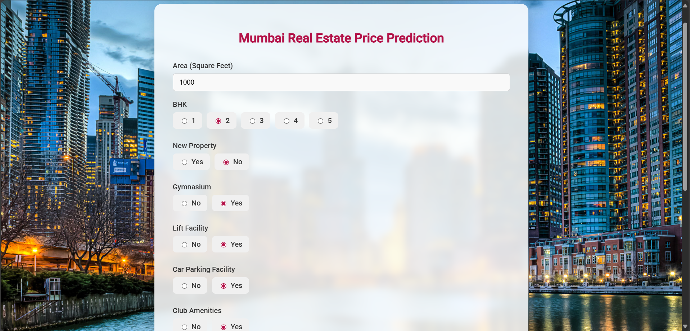

# 🏠 Real Estate Price Prediction

A data science initiative to forecast real estate property values across various neighborhoods in **Mumbai**, India. This project uses **Python**, **Flask**, and **Machine Learning (Linear Regression)** to provide property price estimations based on user inputs such as area, location, and amenities.


---

## 📘 Description

This project predicts the price of a real estate property in Mumbai based on multiple factors. It uses a **Linear Regression** model built with **scikit-learn** and is deployed via a **Flask** server. The interactive UI lets users input details like square footage, location, and other features to receive an estimated property price.

---

## 🎯 Objectives

1. 📊 Analyzed the **Mumbai Home Price Dataset** sourced from Kaggle.
2. 🧹 Cleaned the dataset by filtering anomalies and handling missing values.
3. 🤖 Trained a **Linear Regression** model using **scikit-learn**.
4. 🌐 Built a **Flask** server to serve prediction requests via HTTP.
5. 🖥️ Designed a modern, user-friendly **web interface** using HTML, CSS, and JavaScript to collect user input and display predictions.

---

## 📦 Tech Stack

- **Frontend**: HTML, CSS, JavaScript  
- **Backend**: Python, Flask  
- **Machine Learning**: scikit-learn, pandas, numpy  
- **Tools**: VS Code, Git, Jupyter Notebook

---

## 💻 How It Works

1. The user enters property details through the frontend form.
2. The form sends a request to the Flask server.
3. The server processes the input and uses the trained model to predict a price.
4. The predicted price is returned and displayed on the frontend.

---

## 🗺️ Coverage

The model supports prediction across **90+ localities** in Mumbai.

---


---

## ⚙️ How to Run

### 🔧 1. Clone the Repository

```bash
git clone https://github.com/your-username/Real-Estate-Price-Prediction.git
cd Real-Estate-Price-Prediction

🐍 2. Create Virtual Environment (Optional)
bash
Copy
Edit
python -m venv venv
source venv/bin/activate  # Linux/macOS
venv\Scripts\activate     # Windows

📦 3. Install Dependencies
bash
Copy
Edit
pip install flask flask-cors pandas scikit-learn

▶️ 4. Run the Flask Server
bash
Copy
Edit
cd Server
python server.py
Server will start at http://127.0.0.1:5000

🌐 5. Open the Web App
Simply open Client/index.html in your browser.

📊 Sample Prediction Features

Area (in Sq Ft)

BHK (1 to 5)

New or Resale Property

Gymnasium

Lift Facility

Car Parking

Club Amenities

Gas Connection

Jogging Track

Swimming Pool

Location (e.g., Andheri, Borivali)

